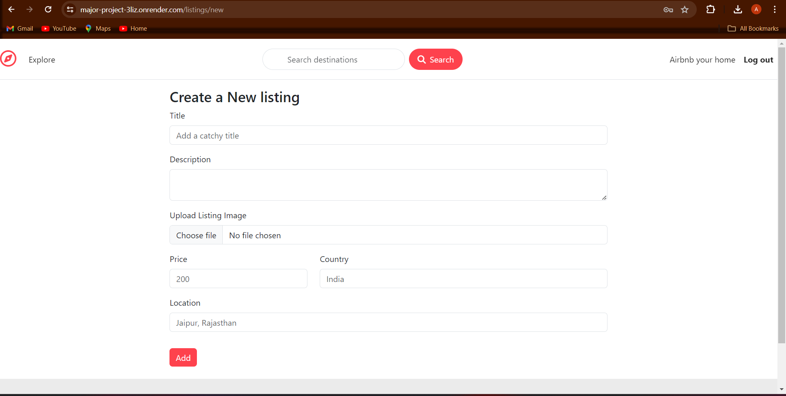
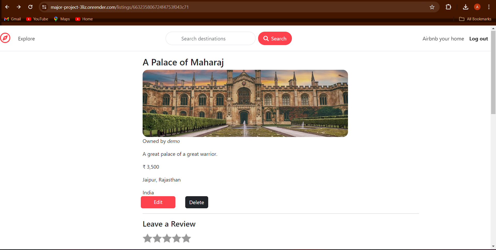
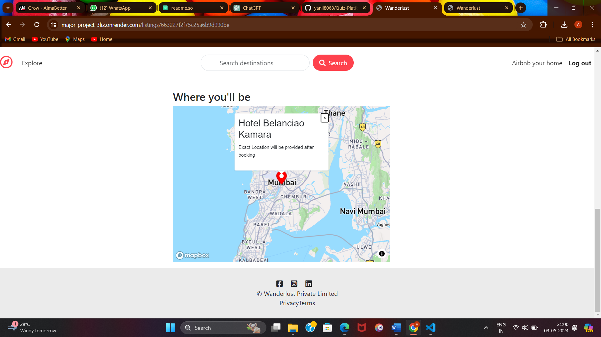
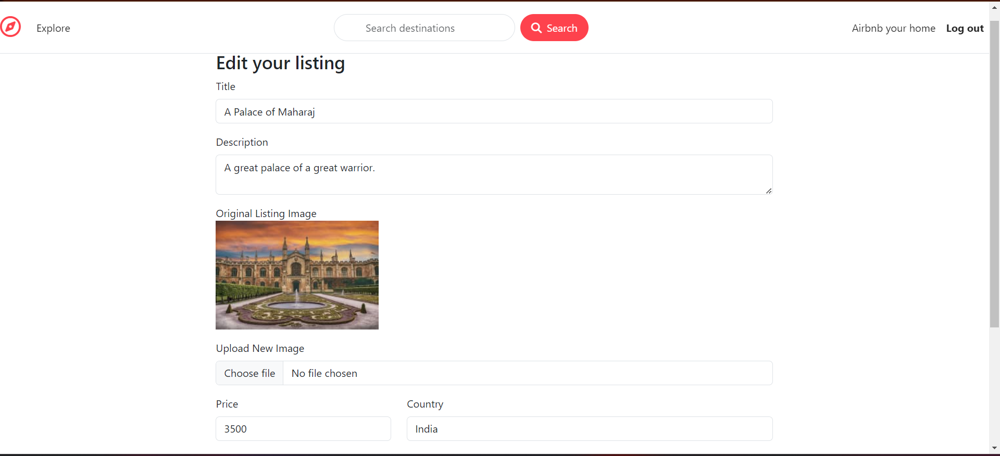
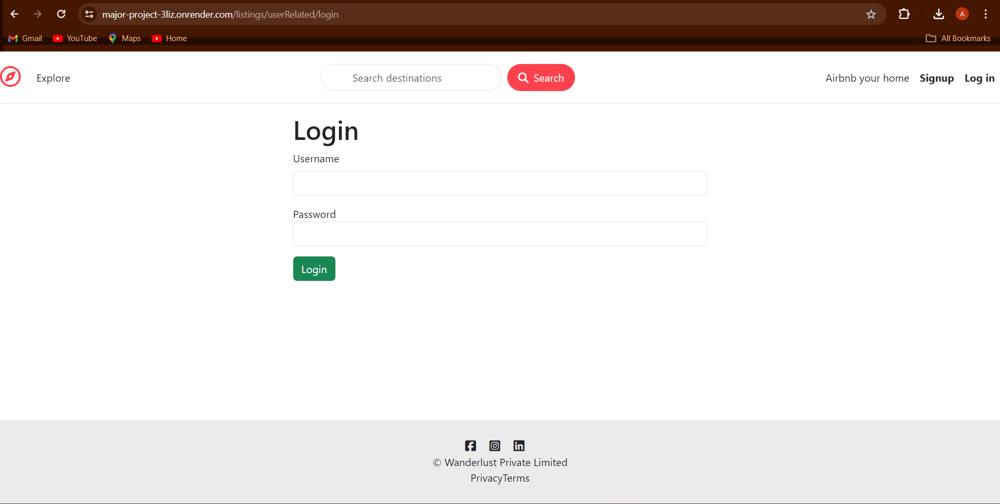
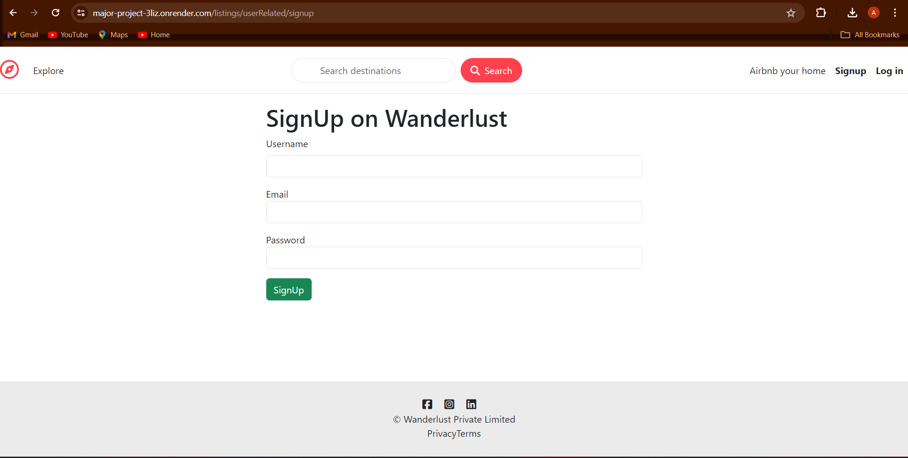

# Airbnb Clone

Description: Experience Airbnb Clone full-stack application utilizing MongoDB, Express.js, Node.js, and an array of complementary technologies like Bootstrap and Mapbox. From authentication to image uploads, and error handling to geocoding, this project encompasses robust functionalities for creating, updating, and showcasing home listings, with deployment on Render for hassle-free access.

## Deployment

Deployed link : https://major-project-3liz.onrender.com/listings

## Tech Stack

MongoDB, Express.js, Node.js, Mongoose, Bootstrap, EJS Template,
Mapbox, Passport.js, Multer, Cloudinary, Cookie-parser, Connect-flash, Ejs-mate .

## Features

- New home listings can be created, updated, deleted, and showcased.
- Implements authentication and authorization for secure access.
- Facilitates image uploads and incorporates map functionality.
- Utilizes middlewares, error handling, validations, and follows the MVC framework for robustness.
- Implements geocoding and MongoDB session storage for enhanced functionality.
- Deployed on Render for accessibility.

## Documentation

--Frontend: I had used Ejs package for frontend pages. In it I had used Bootstrap, Css and Javascript as Well.

--Validation: I had used middlewares for backend validation and also applied frontend validation in all the forms .

--Backend: I had used Nodejs, and Express.js for backend.

--Database : I had used MongoDB Atlas for database and mongoose for object modelling .

--Image upload and Map : For image upload functionality i had used multer package and Cloudinary and for map functionality i had used mapbox .

--Other functionality : MVC Framework is implemented , connect-flash is used for all flash messages , deployed on render.

## Screenshots

