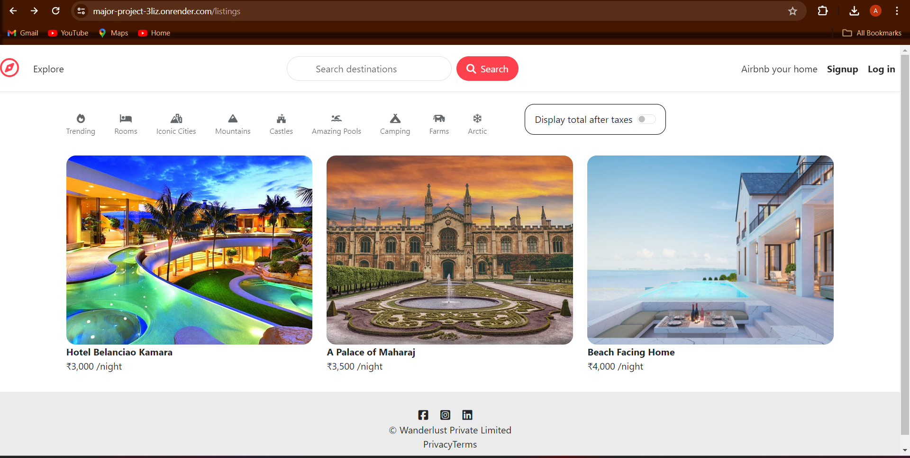

# Airbnb Clone

Description: Experience Airbnb Clone full-stack application utilizing MongoDB, Express.js, Node.js, and an array of complementary technologies like Bootstrap and Mapbox. From authentication to image uploads, and error handling to geocoding, this project encompasses robust functionalities for creating, updating, and showcasing home listings, with deployment on Render for hassle-free access.

## Deployment

Deployed link : https://major-project-3liz.onrender.com/listings

## Tech Stack

MongoDB, Express.js, Node.js, Mongoose, Bootstrap, EJS Template,
Mapbox, Passport.js, multer, Cloudinary, cookie-parser, connect-flash, ejs-mate .

## Explanation :

-New Home listing can be created, updated, deleted and shown.
-Authentication, Authorization, Image upload, use of map functionality are also added.
-Middlewares, Error Handling, Validations, MVC Framework, Geocoding, MongoDB session storage are also implemented.
-Deployed on Render

## Screenshots

